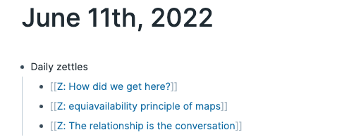

# roamjs-daily-zettles

A [RoamJS] plugin that generates a random set of zettle pages each day.
This is useful if you use the [Zettelkasten] method of note-taking.

Specifically, it automatically adds a list of three page links to the top of your "today" page.
The pages are randomly selected from all pages that contain the `#zettles` tag.

The generated list looks like this:



This was inspired by the [serendipity] plugin ([source][1]), which *almost* does what I want, but not quite.

[1]: https://github.com/dvargas92495/roamjs-com/blob/main/src/entries/serendipity.ts

## Installing

1. Create a block with the following text on any page in your graph.

```
{{[[roam/js]]}}
```

2. Create a single child as a code block, with this code:

```js
const id = "daily-zettles";
const existing = document.getElementById(id);
if (!existing) {
  const extension = document.createElement("script");
  extension.src = "https://lorinhochstein.org/roamjs-daily-zettles/extension.js";
  extension.id = id;
  extension.async = true;
  extension.type = "text/javascript";
  document.getElementsByTagName("head")[0].appendChild(extension);
}
```


## Local development

### Installing the prereqs

This is a javascript project, so you need to have the following installed:

* node
* npm

Once you've got this, install the project dependencies by doing:

```
npm install
```

### Starting the server

First, install [just]. Then do:

```
just run
```

### Loading the JS into your Roam graph

1. Create a block with the following text on any page in your graph.

```
{{[[roam/js]]}}
```

2. Create a single child as a code block, with this code:

```js
const id = "daily-zettles";
const existing = document.getElementById(id);
if (!existing) {
  const extension = document.createElement("script");
  extension.src = "http://localhost:8000/main.js";
  extension.id = id;
  extension.async = true;
  extension.type = "text/javascript";
  document.getElementsByTagName("head")[0].appendChild(extension);
}
```


[just]: https://just.systems/man/en/
[RoamJS]: https://roamjs.com/
[serendipity]: https://roamjs.com/extensions/serendipity
[Zettelkasten]: https://zettelkasten.de/introduction/